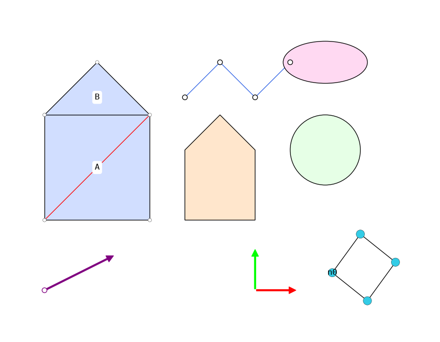

# COMPAS Plotters

**2D visualisation of COMPAS geometry and data structures, powered by matplotlib.**

`compas_plotters` is a lightweight way to draw COMPAS objects in 2D. It is the
COMPAS 2.x successor of the `compas_plotters` package that shipped inside COMPAS
up to version 1.17, rebuilt on top of the modern
[`compas.scene`](https://compas.dev/compas/latest/) system.



## Highlights

- One entry point — [`Plotter.add`][compas_plotters.Plotter.add] — dispatches any
  supported COMPAS object to its matplotlib drawing.
- Built on `compas.scene`: registers a `"Plotter"` visualisation context, exactly
  like the Rhino, Blender and Grasshopper backends.
- Dynamic plotting and GIF recording via
  [`Plotter.on`][compas_plotters.Plotter.on].

## Quick start

```python
from compas.geometry import Point, Line, Polygon
from compas.datastructures import Mesh
from compas_plotters import Plotter

plotter = Plotter(figsize=(8, 5))

mesh = Mesh.from_polyhedron(8)
plotter.add(mesh, show_vertices=True, show_edges=True)
plotter.add(Polygon([[0, 0, 0], [3, 0, 0], [3, 3, 0]]), facecolor=(0.9, 0.9, 1.0))
plotter.add(Line(Point(0, 0, 0), Point(3, 3, 0)), color=(1, 0, 0), draw_as_segment=True)
plotter.add(Point(1.5, 1.5, 0))

plotter.zoom_extents()
plotter.show()
```

## Supported objects

| Category | Objects |
|---|---|
| Geometry | `Point`, `Vector`, `Line`, `Polyline`, `Polygon`, `Circle`, `Ellipse`, `Frame` |
| Shapes (drawn as XY projections) | `Box`, `Sphere`, `Cylinder`, `Cone`, `Capsule`, `Torus`, `Polyhedron` |
| Data structures | `Mesh`, `Graph` |

## Roadmap

The following are not yet supported. They are likely to be added as XY
projections, following the existing `ShapeObject`:

- `Brep` and `Surface` — tessellate to a mesh, then project (`Brep` needs an
  optional backend such as `compas_occ`)
- `NurbsCurve` — sampled to a polyline
- `VolMesh` and `Plane`

## Next steps

- [Installation](installation.md)
- [Tutorial](tutorial.md)
- [API Reference](api/index.md)
